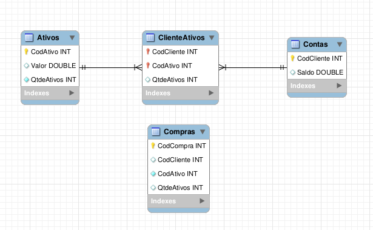

# Processo Seletivo XP. Inc

# Proposta
Desenvolver uma aplicação back-end simulando regras de negócio de uma corretora de valores.
# Desenvolvimento
## 1. Banco de dados
Para desenvolver essa aplcação meu primeiro passo foi desenhar o **Diagrama ER**.

A tabela **Conta** é responsável por armazenar o identificador único de cada Cliente (CodCliente) e seu respectivo saldo em conta.

A tabela **Ativos** é responsável por armazenar o identificador único de cada Ativo (CodAtivo), seu respectivo valor e quantos estão disponíveis para compra.

A tabela intermediária **ClienteAtivos** e a tabela **Compras** são as que fazem o relacionamento dos dados. Por essa relação conseguimos acompanhar quais Clientes têm quais Ativos, quais foram as compras ou vendas efetuadas e como essas operações impactam nos Ativos de cada Cliente.

Com o diagrama desenhado utilizei o ORM **Sequelize** para criar o banco de dados com as devidas migrations e seeds. Com o banco pronto e populado pude criar os models da aplicação.

Foi um desafio conseguir relacionar as tabelas de forma 100% correta, consegui ultrapassar essa barreira depois de algumas horas de tentativa, erro, pesquisa e correção.

## 2. Bibliotecas
  - express - Criação de APIs
  - express-async-errors - Catch automático de exceções
  - joi - Validação de schemas
  - sequelize - ORM
  - mysql2 - Driver necessário para o ORM
  - swagger-ui-express - Documentação
  - swagger-autogen - Automatização da documentação
  - dotenv - Acesso às variáveis de ambiente
  - cors - Permissão de requisições externas para a API

## 3. Criação dos endpoints
Os endpoints foram separados em diferentes Routers para facilitar o entendimento e manutenção do código. Cada Router tem uma responsabilidade específica de acordo com sua função.

Seguindo a arquitetura MSC criei todos os *controllers* e *services* necessários para que a aplicação funcionasse corretamente.

Tendo essas camadas criadas o Sequelize facilita todas as interações com o banco. A partir daí, com tudo dentro do lugar, foi fácil seguir no desenvolvimento, sempre checando se as regras de negócio estavam funcionando como deveriam.

## 4. Validações
Após criar todos os endpoints da aplicação criei as validações necessárias para cada um, não permitindo inserir ou buscar valores que sejam inconsistentes. É usado um middleware de erro no final do arquivo index.js para que qualquer erro disparado ao longo da aplicação seja tratado por ele.

Há erros que são disparados pela biblioteca **Joi** e outros que são disparados pelo "*NotFoundError*", um erro personalizado que retorna o status "*404 - NotFound*" com a mensagem inserida no argumento.

Quase nenhum try-catch é encontrado ao longo do código graças à biblioteca **express-async-errors** que por baixo dos panos se encarrega de inserir um try-catch em todas as requisições.

## 5. Documentaçaão
Usei a biblioteca **swagger-autogen** para criar a documentação de forma automática, necessitando apenas detalhar de forma mais minuciosa nos campos que não são preenchidos pela lib.

## 6. Pontos de melhoria
  - Conteinerização com Docker
  - Autenticação através de JWT e criptografia com BCrypt
  - Testes unitários (mocha, chai e sinon)
  - Documentação Swagger mais detalhada

# Como executar o projeto
Para executar o projeto basta rodar o comando **`npm run xp`** no diretório raíz. O comando `npm run xp` é a junção dos scripts `npm run rs` e `npm run start`.

O script 'rs' é um alias para "Restart Sequelize". O que ele faz é reiniciar o banco de dados inteiro, apagando o atual e criando um novo com as devidas migrations e seeds.
O script 'start' inicia a aplicação normalmente.